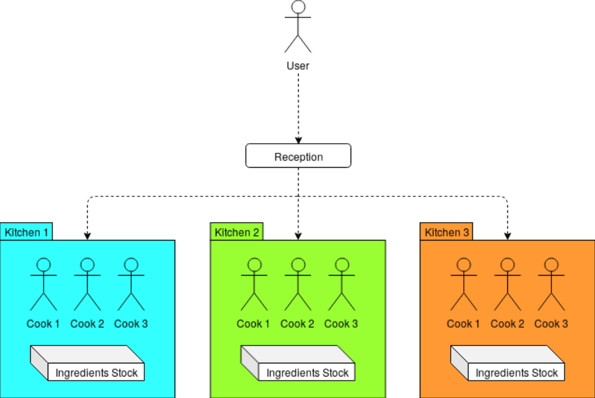

# The Plazza (v0.1)

### Development

By *Natan Pereira* (natan.pereira@epitech.eu),
*Armand Lecomte* (armand.lecomte@epitech.eu)

---

## Presentation

The purpose of this project is to realize a simulation of a pizzeria, which is composed of the
reception that accepts new commands, of several kitchens, themselves with several cooks, themselves
cooking several pizzas.
We learnt to deal with various problems, including load balancing, process and thread synchronization
and communication.



## Getting Started

### Prerequisites

- **Programming Language:** C++
- **Package Manager:** CMake
- **Cmake minimum required**: v.3.28
- **cxx standard**: 20

### Installation for Linux

1. **Clone the repository:**

```sh
git clone git@github.com:Natank25/Epitech2-CCP-ThePlazza.git
```

2. **Navigate to the project directory:**

```sh
cd Epitech2-CCP-ThePlazza
```

3. **Compilation:**

```sh
cmake --build cmake-build-debug --target plazza -j
```

### Execution

```sh
./plazza 2 5 2000
```

- The first parameter is a multiplier for the cooking time of the pizzas.
- The second parameter is the number of cooks per kitchen.
- The third parameter is the time in milliseconds, used by the kitchen stock to replace ingredients.

---

## Credits

Pereira Natan (natan.pereira@epitech.eu)

Lecomte Armand (armand.lecomte@epitech.eu)
